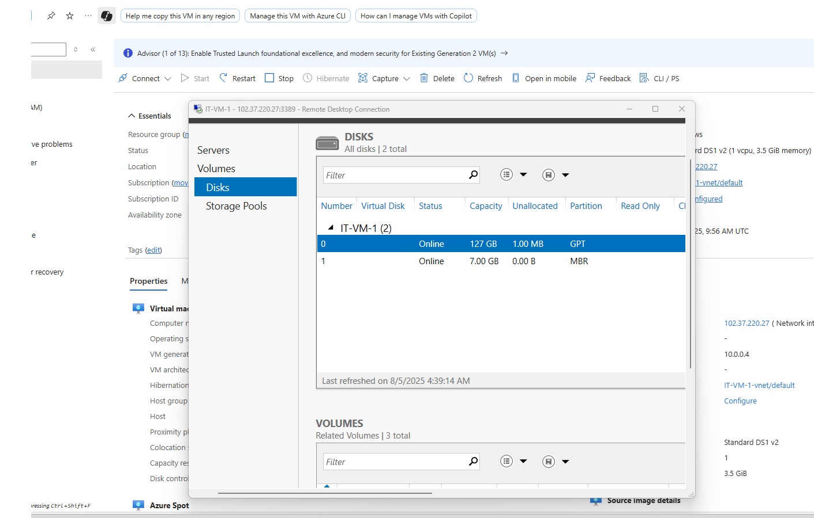
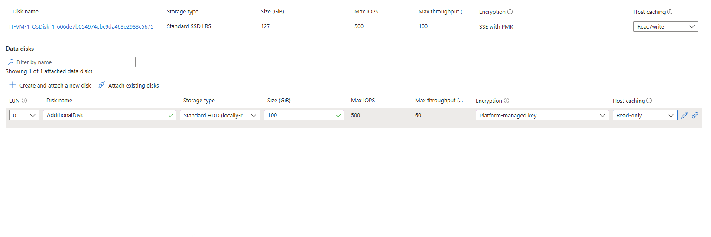
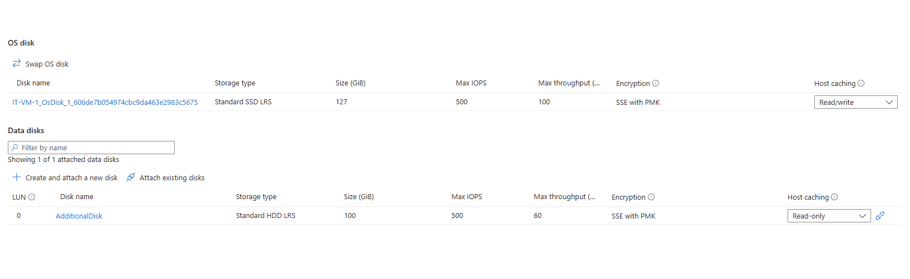
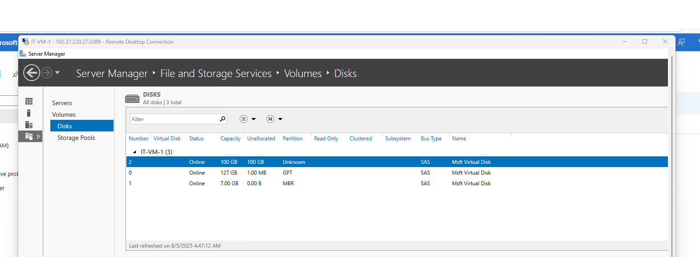
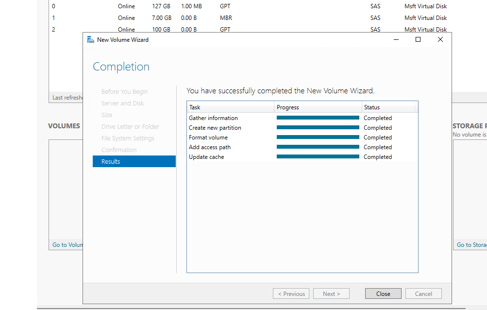
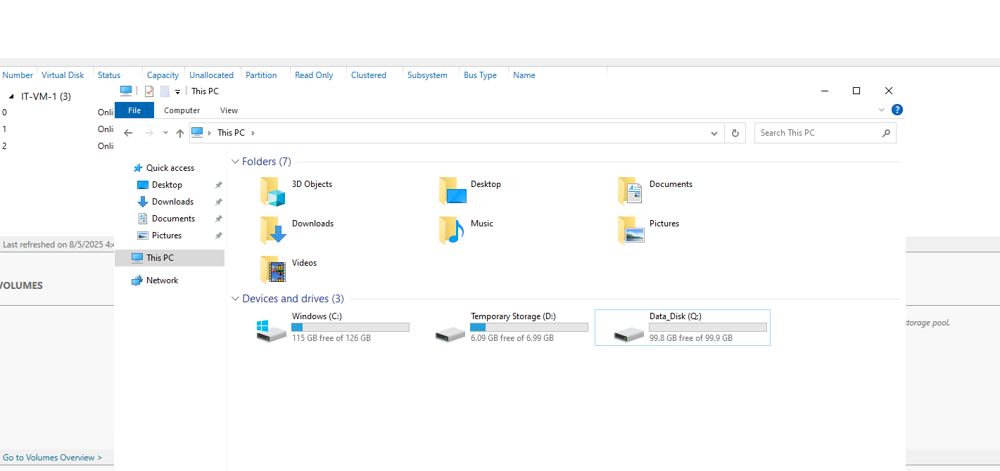

# Azure-Lab-Managing-VM-Disks-Resize-Attach-Data-Disks-
This repo documents my Azure lab where I practiced VM disk management — resizing existing disks and adding new data disks to a VM.

🔹 Step 1: VM Setup

Connected to my existing VM (IT-VM-1) via Azure CLI & RDP.

Verified current configuration: OS disk (127 GB) + temporary disk (7 GB).

📸 Screenshot: 1.png

🔹 Step 2: Attaching a New Data Disk

Added a new 100 GB Standard HDD (AdditionalDisk) via Azure Portal.

Verified disk under VM → Disks blade.

📸 Screenshot: 2.png

🔹 Step 3: Verifying Attached Disks

Inside the VM (Server Manager → File and Storage Services → Disks).

Saw the new 100 GB disk listed as Unallocated.

📸 Screenshot: 3.png

🔹 Step 4: Creating a New Volume

Used New Volume Wizard inside the VM to:

Initialize the disk.

Format with NTFS.

Assign drive letter Q:.

📸 Screenshot: 4.png

🔹 Step 5: Final Disk Configuration

OS Disk → C: (127 GB).

Temporary Storage → D: (7 GB).

New Data Disk → Q: (100 GB).

📸 Screenshot: 5.png

📸 Screenshot: 6.png

✅ End Result:
The VM now has an extra 100 GB of persistent storage, properly mounted and ready for use.

⚡ Key Learnings:

Adding new disks requires both Azure-side configuration (attach disk) and OS-side configuration (initialize, partition, format).

VM disks in Azure come in different SKUs (Standard HDD, SSD, Premium SSD), each with trade-offs.

Always remember the temporary disk (D:) is not persistent — only OS + attached data disks survive reboots/deallocations.
